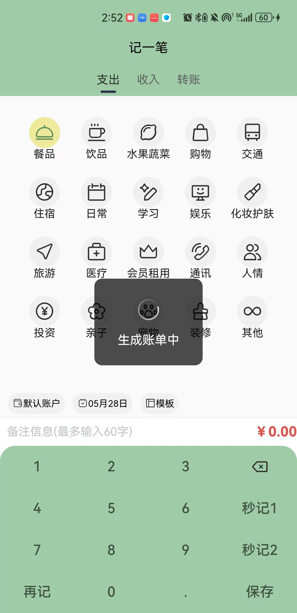
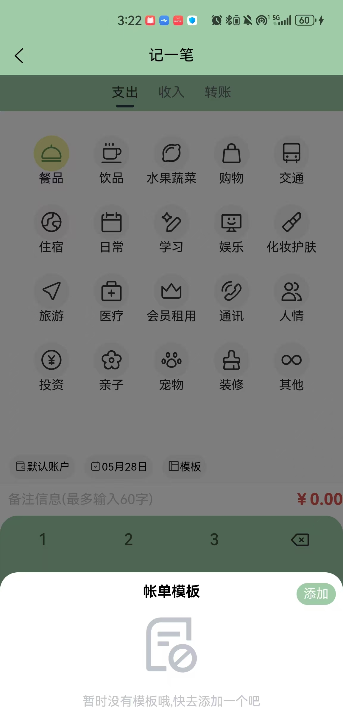
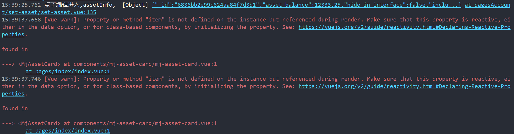
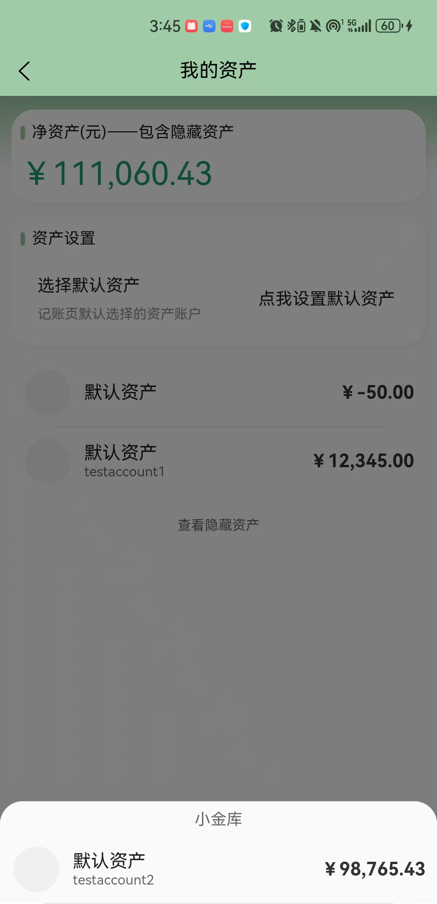
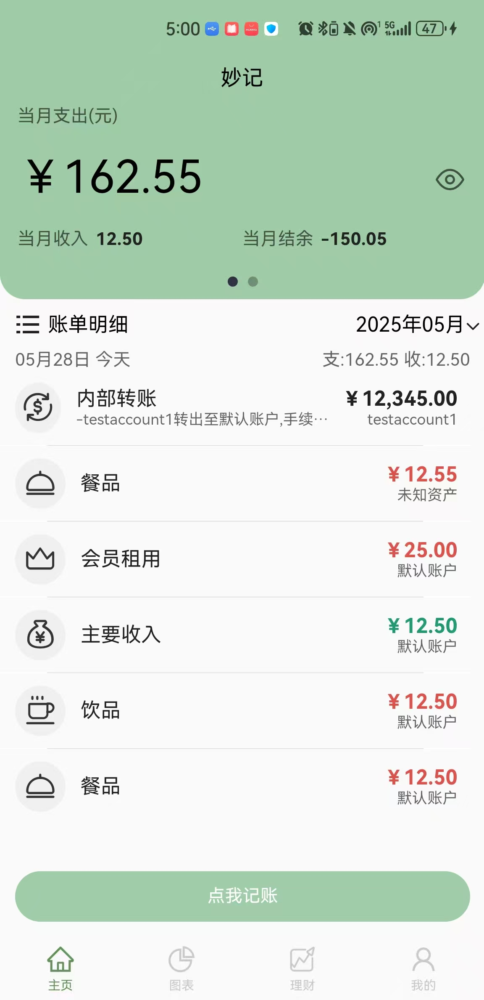

# README

　　　　口袋智富 Pockfi

　　　　原始代码：

　　　　[ztkuaikuai/MiaoJi: 妙记✨记录你的生活。轻量记账小程序，在微信搜索妙记账单体验，使用uniapp与uniCloud进行开发。小程序毕设、毕业设计。](https://github.com/ztkuaikuai/MiaoJi)

### 部署参考：

　　　　妙记是基于 Vue2 的 Uniapp 和 Unicloud 制作的轻量记账应用。目前有微信小程序端和使用 uni-admin 搭建的后台管理 web 端。

　　　　*你可以通过 DeepWiki 生成的*​*[项目文档](https://deepwiki.com/ztkuaikuai/MiaoJi)​*​*来详细了解该项目的结构和实现*。

#### 演示


#### 快速启动⭐

#### 前提条件

1. 妙记通过 HBuilderX 进行开发，在微信开发者工具中预览效果。所以需要你先下载 [HBuilderX](https://hx.dcloud.net.cn/README) 和[微信开发者工具](https://developers.weixin.qq.com/miniprogram/dev/devtools/devtools.html)。
2. 妙记使用 UniCloud 作为云开发平台（可以理解为服务端），需要你在 [UniCloud 控制台](https://unicloud.dcloud.net.cn/)注册登录并创建服务空间，免费的就行，以便后续开发使用。

#### 拷贝项目

　　　　fork 项目到你的仓库拷贝或者直接通过 `git clone`​ 命令拷贝[妙记](https://github.com/ztkuaikuai/MiaoJi)到本地，通过 HBuilderX 打开该项目。

#### 初始化项目

1. 右键 uniCloud 文件夹，关联你的云服务空间。
2. 创建 uni-id 配置文件。在 `/uni_modules/uni-config-center/uniCloud/cloudfunctions/common/uni-config-center`​ 下创建 `uni-id`​文件夹，然后在 `uni-id`​ 文件夹中创建 `config.json`​ ，内容为下**(记得删除所有注释内容)**：

```json
// 配置项参考：https://doc.dcloud.net.cn/uniCloud/uni-id/summary.html#config
{
	"passwordSecret": [{
		"type": "hmac-sha256",
		"version": 1
	}],
	"passwordStrength": "medium",
	"tokenSecret": "这里写你的密钥，可以是无意义的字符串",
	"mp-weixin": {
		"tokenExpiresIn": 259200,
		"tokenExpiresThreshold": 86400,
		"oauth": {
            // 微信小程序登录所用的appid、appsecret需要在对应的小程序管理控制台获取
			"weixin": {
				"appid": "填写你小程序的appid",
				"appsecret": "填写你小程序的appsecret，注意一定不要泄露！"
			}
		}
	},
	"userRegisterDefaultRole": ["USER"]
}
```

3. 上传所有的云函数和数据库表。右键 uniCloud 文件夹中的   `cloudfunctions`​ ，点击「上传所有云函数、公共模块及 Actions」；右键 `database`​ ，点击「上传所有 DB Schema (含扩展)」。

    > 如果中途有弹窗，云函数点击「替换」，云数据库勾选「全部创建」后点「是」。
    >
4. 在 `manifest.json`​ 中更新你的配置。微信小程序配置，将 appid 替换成你自己小程序的 appid ；基础配置，将「uni-app 应用标识」重新获取，利用查找替换将项目中带有 `__UNI__EE89725`​ 的替换成你自己的。
5. 点击 HBuilder 顶部「运行-运行到小程序模拟器-微信开发者工具」运行项目~
6. 配置小程序合法域名，请[参考文档](https://doc.dcloud.net.cn/uniCloud/publish.html#useinmp)

　　　　

#### 运行项目

##### 方法1：使用电脑模拟器

1. 下载市面上任意手机模拟器、如mumu等，安装后启动模拟器
2. 启动HbuilderX，打开项目
3. HbuilderX工具栏——工具——设置——运行配置，将Android模拟器端口设置为模拟器对应的端口、如mumu为7555
4. HbuilderX工具栏——运行——运行到手机或模拟器——运行到Android-App基座
5. 在页面选取模拟器设备，使用标准基座运行，等待编译运行即可

##### 方法2：使用真机

1. 在手机找到开发人员选项（不同手机该选项打开方式不同，比如华为要在关于手机——连续点击鸿蒙版本号框7次才能打开该选项）——勾选USB调试
2. 将电脑USB接口连接至手机（最好使用手机原装数据线、否则可能检测不到），信任设备并进入调试模式，同时保障电脑和手机连接至同一个局域网内、如手机热点
3. 启动HbuilderX，打开项目
4. HbuilderX工具栏——运行——运行到手机或模拟器——运行到Android-App基座
5. 在页面选取手机设备，使用标准基座运行，等待编译运行即可

#### 项目结构

```js
uniCloud/               // 使用阿里云的云空间
  |-cloudfunctions/     // 存放云函数、云对象
  |-database/           // 存放数据库表结构，参考文档：https://siu9p6v1zlb.feishu.cn/docx/WvmfdEmzsoBCIhxUpN6cAw8Nn7b?from=from_copylink
.hbuilderx
components/             // 存放妙记的组件
pages/                  // 存放主要模块，即tabbar的4个页面，其余页面分包处理
pagesAccount/           // 记账模块
pagesFilter/            // 未开发完，筛选模块
pagesMy/                // 我的模块
static/                 // 静态资源，存放icon、图片等
uni_modules/            // 存放在插件市场下载的包
unpackage/
utils/                  // 存放可复用的工具函数
.gitignore
App.vue
CHANGELOG.md
index.html
LICENSE
main.js
manifest.json           // 应用的配置文件
pages.json              // 项目页面配置，相当于微信小程序当中的 app.json
README.md
uni.promisify.adaptor.js
uni.scss                // 全局的样式文件
```

　　　　‍

　　　　‍

### 待办清单：

#### 1. 页面分类和基础交互

- [X] 主页（记账）

  <div>
  <div class="siyuan-plugin-task-date-info-wrapper" contenteditable="false" data-type="siyuan-plugin-custom-wrapper" style="position: absolute; top: 0px; right: 0px; left: 0px; pointer-events: none !important;"><div class="siyuan-plugin-task-date-info" contenteditable="true" data-editable="false" spellcheck="false" data-type="siyuan-plugin-custom-date-info" style="position: absolute; font-size: 10px; color: rgb(136, 136, 136); text-align: right; right: 20px; top: -12px; pointer-events: none !important; user-select: none !important;">完成时间: 2025-05-23</div></div>

  - 标准测试：

    - [X] 点击隐藏按钮：正确显示用户当前支出，再次点击隐藏
    - [X] 切换月份日期：正确切换月份，并显示对应账单；正确显示合理月份日期，比如当前最多为5月
    - [X] 右滑切换到净资产：正确切换显示
    - [X] 左滑切换回到记账：正确切换显示
  - 边界测试：

    - [X] 切换特殊月份日期：切换到2025年2月，发现最多28天；切换到2024年2月，发现最多29天
  
- [X] 图表

  <div>
  <div class="siyuan-plugin-task-date-info-wrapper" contenteditable="false" data-type="siyuan-plugin-custom-wrapper" style="position: absolute; top: 0px; right: 0px; left: 0px; pointer-events: none !important;"><div class="siyuan-plugin-task-date-info" contenteditable="true" data-editable="false" spellcheck="false" data-type="siyuan-plugin-custom-date-info" style="position: absolute; font-size: 10px; color: rgb(136, 136, 136); text-align: right; right: 20px; top: -12px; pointer-events: none !important; user-select: none !important;">完成时间: 2025-05-23</div></div>

  - 标准测试：

    - [x] 切换月份日期：正确切换月份，并显示对应账单；正确显示合理月份日期，比如当前最多为5月
    
    - [x] 上下滑动：正确滑动显示
    
      
  
- [X] 理财

  <div>
  <div class="siyuan-plugin-task-date-info-wrapper" contenteditable="false" data-type="siyuan-plugin-custom-wrapper" style="position: absolute; top: 0px; right: 0px; left: 0px; pointer-events: none !important;"><div class="siyuan-plugin-task-date-info" contenteditable="true" data-editable="false" spellcheck="false" data-type="siyuan-plugin-custom-date-info" style="position: absolute; font-size: 10px; color: rgb(136, 136, 136); text-align: right; right: 20px; top: -12px; pointer-events: none !important; user-select: none !important;">完成时间: 2025-05-23</div></div>

  - 标准测试：

    - [x] 切换利率计算器、股票分析：正确进行切换显示
    
      
  
- [x] 提醒

  <div class="siyuan-plugin-task-date-info-wrapper" contenteditable="false" data-type="siyuan-plugin-custom-wrapper" style="position: absolute; top: 0px; right: 0px; left: 0px; pointer-events: none !important;"><div class="siyuan-plugin-task-date-info" contenteditable="true" data-editable="false" spellcheck="false" data-type="siyuan-plugin-custom-date-info" style="position: absolute; font-size: 10px; color: rgb(136, 136, 136); text-align: right; right: 20px; top: -12px; pointer-events: none !important; user-select: none !important;">完成时间: 2025-06-02</div></div>

  - 标准测试：

    - [x] 切换月度预算、存钱目标：正确进行切换显示

    - [x] 显示当前预算进度：正确显示，正确显示进度、金额等

    - [x] 显示存钱目标列表：正确显示，正确显示进度、金额、进行中或已完成标签等

      

- [X] 我的

  <div>
  <div class="siyuan-plugin-task-date-info-wrapper" contenteditable="false" data-type="siyuan-plugin-custom-wrapper" style="position: absolute; top: 0px; right: 0px; left: 0px; pointer-events: none !important;"><div class="siyuan-plugin-task-date-info" contenteditable="true" data-editable="false" spellcheck="false" data-type="siyuan-plugin-custom-date-info" style="position: absolute; font-size: 10px; color: rgb(136, 136, 136); text-align: right; right: 20px; top: -12px; pointer-events: none !important; user-select: none !important;">完成时间: 2025-05-23</div></div>
  
  
  - 标准测试：
  
    - [x] 点击卡片：正确进入卡片展示
    - [x] 点击功能栏：正确进入对应功能界面
    - [x] 点击其他栏：正确进入其他内容界面
  
  - 改进建议(可选)：
  
    - [ ] 功能描述和用例没有的、且较难实现的功能可以考虑直接切了？
  
      
  
- [X] 登录

  <div>
  <div class="siyuan-plugin-task-date-info-wrapper" contenteditable="false" data-type="siyuan-plugin-custom-wrapper" style="position: absolute; top: 0px; right: 0px; left: 0px; pointer-events: none !important;"><div class="siyuan-plugin-task-date-info" contenteditable="true" data-editable="false" spellcheck="false" data-type="siyuan-plugin-custom-date-info" style="position: absolute; font-size: 10px; color: rgb(136, 136, 136); text-align: right; right: 20px; top: -12px; pointer-events: none !important; user-select: none !important;">完成时间: 2025-05-23</div></div>

  - 标准测试：
    - [x] 未登录时切换到任意页面：正确提示登录
    - [x] 进入软件：正确提示进行登录

#### 2. 记账模块

- [X] 手动添加消费记录

  <div>
  <div class="siyuan-plugin-task-date-info-wrapper" contenteditable="false" data-type="siyuan-plugin-custom-wrapper" style="position: absolute; top: 0px; right: 0px; left: 0px; pointer-events: none !important;"><div class="siyuan-plugin-task-date-info" contenteditable="true" data-editable="false" spellcheck="false" data-type="siyuan-plugin-custom-date-info" style="position: absolute; font-size: 10px; color: rgb(136, 136, 136); text-align: right; right: 20px; top: -12px; pointer-events: none !important; user-select: none !important;">完成时间: 2025-05-23</div></div>

  - 标准测试：
    - [x] 记账——点我记账——再记：显示“生成账单中”，并持续加载无反馈，如果此时使用返回操作中断会在“记一笔”页面无法返回、此时左上角返回按钮消失。[测试截图](#记账——点我记账——再记)
      - 初步定位：Pockfi/pagesAccount/make-an-account/make-an-account.vue——addAgain()
      
      <div class="siyuan-plugin-task-date-info-wrapper" contenteditable="false" data-type="siyuan-plugin-custom-wrapper" style="position: absolute; top: 0px; right: 0px; left: 0px; pointer-events: none !important;"><div class="siyuan-plugin-task-date-info" contenteditable="true" data-editable="false" spellcheck="false" data-type="siyuan-plugin-custom-date-info" style="position: absolute; font-size: 10px; color: rgb(136, 136, 136); text-align: right; right: 20px; top: -12px; pointer-events: none !important; user-select: none !important;">发现时间: 2025-05-28</div></div>
      
      <div class="siyuan-plugin-task-date-info-wrapper" contenteditable="false" data-type="siyuan-plugin-custom-wrapper" style="position: absolute; top: 0px; right: 0px; left: 0px; pointer-events: none !important;"><div class="siyuan-plugin-task-date-info" contenteditable="true" data-editable="false" spellcheck="false" data-type="siyuan-plugin-custom-date-info" style="position: absolute; font-size: 10px; color: rgb(136, 136, 136); text-align: right; right: 20px; top: -12px; pointer-events: none !important; user-select: none !important;">已解决
          时间: 2025-05-30</div></div>
      
    - [x] 记账——点我记账——保存——输入金额：正确输入金额，并正确退格
    
    - [x] 记账——点我记账——保存——选择日期：正确选择日期
    
    - [x] 记账——点我记账——保存——选择资产：正确选择资产
    
    - [x] 记账——点我记账——保存——支出：正确输入金额，正确选择分类，并正确保存
    
    - [x] 记账——点我记账——保存——收入：正确输入金额，正确选择分类，并正确保存
    
    - [x] 记账——点我记账——保存——转账：正确输入金额，正确选择转账资产，正确输入手续费，并正确产生转账，但是实际资产并未变化。[测试截图](#记账——点我记账——保存——收入)
    
      <div class="siyuan-plugin-task-date-info-wrapper" contenteditable="false" data-type="siyuan-plugin-custom-wrapper" style="position: absolute; top: 0px; right: 0px; left: 0px; pointer-events: none !important;"><div class="siyuan-plugin-task-date-info" contenteditable="true" data-editable="false" spellcheck="false" data-type="siyuan-plugin-custom-date-info" style="position: absolute; font-size: 10px; color: rgb(136, 136, 136); text-align: right; right: 20px; top: -12px; pointer-events: none !important; user-select: none !important;">发现时间: 2025-05-28</div></div>
    
      <div class="siyuan-plugin-task-date-info-wrapper" contenteditable="false" data-type="siyuan-plugin-custom-wrapper" style="position: absolute; top: 0px; right: 0px; left: 0px; pointer-events: none !important;"><div class="siyuan-plugin-task-date-info" contenteditable="true" data-editable="false" spellcheck="false" data-type="siyuan-plugin-custom-date-info" style="position: absolute; font-size: 10px; color: rgb(136, 136, 136); text-align: right; right: 20px; top: -12px; pointer-events: none !important; user-select: none !important;">已解决 时间: 2025-06-02</div></div>
    
    - [x] 记账——点我记账——添加模板：添加新模板，点击保存，并正确添加
    
    - [x] 记账——点我记账——模板：选择模板，绝大部分时候模板加载不出来，即使加载出来也无法使用。[测试截图](#记账——点我记账——模板)
    
      <div class="siyuan-plugin-task-date-info-wrapper" contenteditable="false" data-type="siyuan-plugin-custom-wrapper" style="position: absolute; top: 0px; right: 0px; left: 0px; pointer-events: none !important;"><div class="siyuan-plugin-task-date-info" contenteditable="true" data-editable="false" spellcheck="false" data-type="siyuan-plugin-custom-date-info" style="position: absolute; font-size: 10px; color: rgb(136, 136, 136); text-align: right; right: 20px; top: -12px; pointer-events: none !important; user-select: none !important;">发现时间: 2025-05-28</div></div>
    
      <div class="siyuan-plugin-task-date-info-wrapper" contenteditable="false" data-type="siyuan-plugin-custom-wrapper" style="position: absolute; top: 0px; right: 0px; left: 0px; pointer-events: none !important;"><div class="siyuan-plugin-task-date-info" contenteditable="true" data-editable="false" spellcheck="false" data-type="siyuan-plugin-custom-date-info" style="position: absolute; font-size: 10px; color: rgb(136, 136, 136); text-align: right; right: 20px; top: -12px; pointer-events: none !important; user-select: none !important;">已解决
          时间: 2025-05-30</div></div>

    - [x] 记账——点我记账——秒记1、秒记2：客户端提示“未找到绑定的模板”，没有检测到已经创建的模板
    
      <div class="siyuan-plugin-task-date-info-wrapper" contenteditable="false" data-type="siyuan-plugin-custom-wrapper" style="position: absolute; top: 0px; right: 0px; left: 0px; pointer-events: none !important;"><div class="siyuan-plugin-task-date-info" contenteditable="true" data-editable="false" spellcheck="false" data-type="siyuan-plugin-custom-date-info" style="position: absolute; font-size: 10px; color: rgb(136, 136, 136); text-align: right; right: 20px; top: -12px; pointer-events: none !important; user-select: none !important;">发现时间: 2025-05-28</div></div>
      
      <div class="siyuan-plugin-task-date-info-wrapper" contenteditable="false" data-type="siyuan-plugin-custom-wrapper" style="position: absolute; top: 0px; right: 0px; left: 0px; pointer-events: none !important;"><div class="siyuan-plugin-task-date-info" contenteditable="true" data-editable="false" spellcheck="false" data-type="siyuan-plugin-custom-date-info" style="position: absolute; font-size: 10px; color: rgb(136, 136, 136); text-align: right; right: 20px; top: -12px; pointer-events: none !important; user-select: none !important;">已分配
          时间: 2025-05-30</div></div>
      
      <div class="siyuan-plugin-task-date-info-wrapper" contenteditable="false" data-type="siyuan-plugin-custom-wrapper" style="position: absolute; top: 0px; right: 0px; left: 0px; pointer-events: none !important;"><div class="siyuan-plugin-task-date-info" contenteditable="true" data-editable="false" spellcheck="false" data-type="siyuan-plugin-custom-date-info" style="position: absolute; font-size: 10px; color: rgb(136, 136, 136); text-align: right; right: 20px; top: -12px; pointer-events: none !important; user-select: none !important;">已解决 时间: 2025-06-02</div></div>
    
  - 边界测试：
  
    - [x] 记账——点我记账——保存——超长金额：客户端正确提示输入“金额长度不能超过8位”
    
    - [ ] 记账——点我记账——保存——0金额：正确不进行记账，但是客户端没有提示
    
      <div class="siyuan-plugin-task-date-info-wrapper" contenteditable="false" data-type="siyuan-plugin-custom-wrapper" style="position: absolute; top: 0px; right: 0px; left: 0px; pointer-events: none !important;"><div class="siyuan-plugin-task-date-info" contenteditable="true" data-editable="false" spellcheck="false" data-type="siyuan-plugin-custom-date-info" style="position: absolute; font-size: 10px; color: rgb(136, 136, 136); text-align: right; right: 20px; top: -12px; pointer-events: none !important; user-select: none !important;">发现时间: 2025-06-09</div></div>
    
    - [ ] 记账——点我记账——保存——转账——负数手续费：正确不进行记账，但是客户端提示为小数位数错误
    
      <div class="siyuan-plugin-task-date-info-wrapper" contenteditable="false" data-type="siyuan-plugin-custom-wrapper" style="position: absolute; top: 0px; right: 0px; left: 0px; pointer-events: none !important;"><div class="siyuan-plugin-task-date-info" contenteditable="true" data-editable="false" spellcheck="false" data-type="siyuan-plugin-custom-date-info" style="position: absolute; font-size: 10px; color: rgb(136, 136, 136); text-align: right; right: 20px; top: -12px; pointer-events: none !important; user-select: none !important;">发现时间: 2025-06-09</div></div>
    
      
    
  - 改进建议(可选)：
  
    - [x] 记账——点我记账——保存：成功保存客户端不给出提示，可以考虑加上提示
  
      <div class="siyuan-plugin-task-date-info-wrapper" contenteditable="false" data-type="siyuan-plugin-custom-wrapper" style="position: absolute; top: 0px; right: 0px; left: 0px; pointer-events: none !important;"><div class="siyuan-plugin-task-date-info" contenteditable="true" data-editable="false" spellcheck="false" data-type="siyuan-plugin-custom-date-info" style="position: absolute; font-size: 10px; color: rgb(136, 136, 136); text-align: right; right: 20px; top: -12px; pointer-events: none !important; user-select: none !important;">已分配
          时间: 2025-05-30</div></div>
      
      <div class="siyuan-plugin-task-date-info-wrapper" contenteditable="false" data-type="siyuan-plugin-custom-wrapper" style="position: absolute; top: 0px; right: 0px; left: 0px; pointer-events: none !important;"><div class="siyuan-plugin-task-date-info" contenteditable="true" data-editable="false" spellcheck="false" data-type="siyuan-plugin-custom-date-info" style="position: absolute; font-size: 10px; color: rgb(136, 136, 136); text-align: right; right: 20px; top: -12px; pointer-events: none !important; user-select: none !important;">已解决 时间: 2025-06-02</div></div>
  
  
  
- [X] 编辑账目记录

  <div>
  <div class="siyuan-plugin-task-date-info-wrapper" contenteditable="false" data-type="siyuan-plugin-custom-wrapper" style="position: absolute; top: 0px; right: 0px; left: 0px; pointer-events: none !important;"><div class="siyuan-plugin-task-date-info" contenteditable="true" data-editable="false" spellcheck="false" data-type="siyuan-plugin-custom-date-info" style="position: absolute; font-size: 10px; color: rgb(136, 136, 136); text-align: right; right: 20px; top: -12px; pointer-events: none !important; user-select: none !important;">完成时间: 2025-05-23</div></div>

  - 标准测试：

    - [X] 记账——左滑账单——修改：正确修改账单信息
    - [X] 记账——左滑账单——删除：客户端正确显示二次确认信息，正确删除账单
    
  - 边界测试：
  
    - [x] 记账——左滑账单——修改——超长金额：客户端正确提示输入“金额长度不能超过8位”
    
    - [ ] 记账——点我记账——保存——0金额：正确不进行记账，但是客户端没有提示
    
      <div class="siyuan-plugin-task-date-info-wrapper" contenteditable="false" data-type="siyuan-plugin-custom-wrapper" style="position: absolute; top: 0px; right: 0px; left: 0px; pointer-events: none !important;"><div class="siyuan-plugin-task-date-info" contenteditable="true" data-editable="false" spellcheck="false" data-type="siyuan-plugin-custom-date-info" style="position: absolute; font-size: 10px; color: rgb(136, 136, 136); text-align: right; right: 20px; top: -12px; pointer-events: none !important; user-select: none !important;">发现时间: 2025-06-09</div></div>
    
  - 改进建议(可选)：
  
    - [x] 记账——左滑账单——修改：成功保存客户端不给出提示，可以考虑加上提示
  
      <div class="siyuan-plugin-task-date-info-wrapper" contenteditable="false" data-type="siyuan-plugin-custom-wrapper" style="position: absolute; top: 0px; right: 0px; left: 0px; pointer-events: none !important;"><div class="siyuan-plugin-task-date-info" contenteditable="true" data-editable="false" spellcheck="false" data-type="siyuan-plugin-custom-date-info" style="position: absolute; font-size: 10px; color: rgb(136, 136, 136); text-align: right; right: 20px; top: -12px; pointer-events: none !important; user-select: none !important;">已修复
          时间: 2025-05-28</div></div>
      
      <div class="siyuan-plugin-task-date-info-wrapper" contenteditable="false" data-type="siyuan-plugin-custom-wrapper" style="position: absolute; top: 0px; right: 0px; left: 0px; pointer-events: none !important;"><div class="siyuan-plugin-task-date-info" contenteditable="true" data-editable="false" spellcheck="false" data-type="siyuan-plugin-custom-date-info" style="position: absolute; font-size: 10px; color: rgb(136, 136, 136); text-align: right; right: 20px; top: -12px; pointer-events: none !important; user-select: none !important;">已解决 时间: 2025-06-02</div></div>
  
  
  
- [ ] 手动编辑消费类型

  

- [ ] 半**自动记录**消费

  

- [ ] 反馈消费类型识别错误

  

- [ ] 实时对照消费预算

  

- [X] 资产模块（添加/删除/与消费记录绑定）

  <div>
  <div class="siyuan-plugin-task-date-info-wrapper" contenteditable="false" data-type="siyuan-plugin-custom-wrapper" style="position: absolute; top: 0px; right: 0px; left: 0px; pointer-events: none !important;"><div class="siyuan-plugin-task-date-info" contenteditable="true" data-editable="false" spellcheck="false" data-type="siyuan-plugin-custom-date-info" style="position: absolute; font-size: 10px; color: rgb(136, 136, 136); text-align: right; right: 20px; top: -12px; pointer-events: none !important; user-select: none !important;">完成时间: 2025-05-23</div></div>

  - 标准测试：
  
    - [x] 资产——管理：正确切换显示，但是无法正常显示资产图标，且后台产生报错信息，这也可能是整个净资产模块报错的原因。[测试截图](#净资产——管理)
  
      <div class="siyuan-plugin-task-date-info-wrapper" contenteditable="false" data-type="siyuan-plugin-custom-wrapper" style="position: absolute; top: 0px; right: 0px; left: 0px; pointer-events: none !important;"><div class="siyuan-plugin-task-date-info" contenteditable="true" data-editable="false" spellcheck="false" data-type="siyuan-plugin-custom-date-info" style="position: absolute; font-size: 10px; color: rgb(136, 136, 136); text-align: right; right: 20px; top: -12px; pointer-events: none !important; user-select: none !important;">发现时间: 2025-05-28</div></div>
  
      <div class="siyuan-plugin-task-date-info-wrapper" contenteditable="false" data-type="siyuan-plugin-custom-wrapper" style="position: absolute; top: 0px; right: 0px; left: 0px; pointer-events: none !important;"><div class="siyuan-plugin-task-date-info" contenteditable="true" data-editable="false" spellcheck="false" data-type="siyuan-plugin-custom-date-info" style="position: absolute; font-size: 10px; color: rgb(136, 136, 136); text-align: right; right: 20px; top: -12px; pointer-events: none !important; user-select: none !important;">已解决
          时间: 2025-05-30</div></div>
    
    - [x] 资产——添加资产：正确添加资产，并可选择资产类别，是否隐藏、是否计入总资产，但是后台产生报错信息。
    
      <div class="siyuan-plugin-task-date-info-wrapper" contenteditable="false" data-type="siyuan-plugin-custom-wrapper" style="position: absolute; top: 0px; right: 0px; left: 0px; pointer-events: none !important;"><div class="siyuan-plugin-task-date-info" contenteditable="true" data-editable="false" spellcheck="false" data-type="siyuan-plugin-custom-date-info" style="position: absolute; font-size: 10px; color: rgb(136, 136, 136); text-align: right; right: 20px; top: -12px; pointer-events: none !important; user-select: none !important;">发现时间: 2025-05-28</div></div>
    
      <div class="siyuan-plugin-task-date-info-wrapper" contenteditable="false" data-type="siyuan-plugin-custom-wrapper" style="position: absolute; top: 0px; right: 0px; left: 0px; pointer-events: none !important;"><div class="siyuan-plugin-task-date-info" contenteditable="true" data-editable="false" spellcheck="false" data-type="siyuan-plugin-custom-date-info" style="position: absolute; font-size: 10px; color: rgb(136, 136, 136); text-align: right; right: 20px; top: -12px; pointer-events: none !important; user-select: none !important;">已解决
          时间: 2025-05-30</div></div>
  
    - [x] 资产——查看隐藏资产：正确显示隐藏资产，但是后台产生报错信息。
    
      <div class="siyuan-plugin-task-date-info-wrapper" contenteditable="false" data-type="siyuan-plugin-custom-wrapper" style="position: absolute; top: 0px; right: 0px; left: 0px; pointer-events: none !important;"><div class="siyuan-plugin-task-date-info" contenteditable="true" data-editable="false" spellcheck="false" data-type="siyuan-plugin-custom-date-info" style="position: absolute; font-size: 10px; color: rgb(136, 136, 136); text-align: right; right: 20px; top: -12px; pointer-events: none !important; user-select: none !important;">发现时间: 2025-05-28</div></div>
    
      <div class="siyuan-plugin-task-date-info-wrapper" contenteditable="false" data-type="siyuan-plugin-custom-wrapper" style="position: absolute; top: 0px; right: 0px; left: 0px; pointer-events: none !important;"><div class="siyuan-plugin-task-date-info" contenteditable="true" data-editable="false" spellcheck="false" data-type="siyuan-plugin-custom-date-info" style="position: absolute; font-size: 10px; color: rgb(136, 136, 136); text-align: right; right: 20px; top: -12px; pointer-events: none !important; user-select: none !important;">已解决
          时间: 2025-05-30</div></div>
    
    - [x] 资产——管理——选择默认资产：正确切换默认资产，但是后台产生报错信息。
    
      <div class="siyuan-plugin-task-date-info-wrapper" contenteditable="false" data-type="siyuan-plugin-custom-wrapper" style="position: absolute; top: 0px; right: 0px; left: 0px; pointer-events: none !important;"><div class="siyuan-plugin-task-date-info" contenteditable="true" data-editable="false" spellcheck="false" data-type="siyuan-plugin-custom-date-info" style="position: absolute; font-size: 10px; color: rgb(136, 136, 136); text-align: right; right: 20px; top: -12px; pointer-events: none !important; user-select: none !important;">发现时间: 2025-05-28</div></div>
    
      <div class="siyuan-plugin-task-date-info-wrapper" contenteditable="false" data-type="siyuan-plugin-custom-wrapper" style="position: absolute; top: 0px; right: 0px; left: 0px; pointer-events: none !important;"><div class="siyuan-plugin-task-date-info" contenteditable="true" data-editable="false" spellcheck="false" data-type="siyuan-plugin-custom-date-info" style="position: absolute; font-size: 10px; color: rgb(136, 136, 136); text-align: right; right: 20px; top: -12px; pointer-events: none !important; user-select: none !important;">已解决
          时间: 2025-05-30</div></div>
    
    - [x] 资产——点击隐藏按钮：正确显示用户当前支出，再次点击隐藏，但是后台产生报错信息。
    
      <div class="siyuan-plugin-task-date-info-wrapper" contenteditable="false" data-type="siyuan-plugin-custom-wrapper" style="position: absolute; top: 0px; right: 0px; left: 0px; pointer-events: none !important;"><div class="siyuan-plugin-task-date-info" contenteditable="true" data-editable="false" spellcheck="false" data-type="siyuan-plugin-custom-date-info" style="position: absolute; font-size: 10px; color: rgb(136, 136, 136); text-align: right; right: 20px; top: -12px; pointer-events: none !important; user-select: none !important;">发现时间: 2025-05-28</div></div>
    
      <div class="siyuan-plugin-task-date-info-wrapper" contenteditable="false" data-type="siyuan-plugin-custom-wrapper" style="position: absolute; top: 0px; right: 0px; left: 0px; pointer-events: none !important;"><div class="siyuan-plugin-task-date-info" contenteditable="true" data-editable="false" spellcheck="false" data-type="siyuan-plugin-custom-date-info" style="position: absolute; font-size: 10px; color: rgb(136, 136, 136); text-align: right; right: 20px; top: -12px; pointer-events: none !important; user-select: none !important;">已解决
          时间: 2025-05-30</div></div>
    
    - [x] 资产——左滑资产——修改：正确修改资产信息，但是后台产生报错信息。
    
      <div class="siyuan-plugin-task-date-info-wrapper" contenteditable="false" data-type="siyuan-plugin-custom-wrapper" style="position: absolute; top: 0px; right: 0px; left: 0px; pointer-events: none !important;"><div class="siyuan-plugin-task-date-info" contenteditable="true" data-editable="false" spellcheck="false" data-type="siyuan-plugin-custom-date-info" style="position: absolute; font-size: 10px; color: rgb(136, 136, 136); text-align: right; right: 20px; top: -12px; pointer-events: none !important; user-select: none !important;">发现时间: 2025-05-28</div></div>
    
      <div class="siyuan-plugin-task-date-info-wrapper" contenteditable="false" data-type="siyuan-plugin-custom-wrapper" style="position: absolute; top: 0px; right: 0px; left: 0px; pointer-events: none !important;"><div class="siyuan-plugin-task-date-info" contenteditable="true" data-editable="false" spellcheck="false" data-type="siyuan-plugin-custom-date-info" style="position: absolute; font-size: 10px; color: rgb(136, 136, 136); text-align: right; right: 20px; top: -12px; pointer-events: none !important; user-select: none !important;">已解决
          时间: 2025-05-30</div></div>
    
    - [x] 资产——左滑资产——删除：客户端正确显示二次确认信息，正确删除账单，但是后台产生报错信息。
    
      <div class="siyuan-plugin-task-date-info-wrapper" contenteditable="false" data-type="siyuan-plugin-custom-wrapper" style="position: absolute; top: 0px; right: 0px; left: 0px; pointer-events: none !important;"><div class="siyuan-plugin-task-date-info" contenteditable="true" data-editable="false" spellcheck="false" data-type="siyuan-plugin-custom-date-info" style="position: absolute; font-size: 10px; color: rgb(136, 136, 136); text-align: right; right: 20px; top: -12px; pointer-events: none !important; user-select: none !important;">发现时间: 2025-05-28</div></div>
      
      <div class="siyuan-plugin-task-date-info-wrapper" contenteditable="false" data-type="siyuan-plugin-custom-wrapper" style="position: absolute; top: 0px; right: 0px; left: 0px; pointer-events: none !important;"><div class="siyuan-plugin-task-date-info" contenteditable="true" data-editable="false" spellcheck="false" data-type="siyuan-plugin-custom-date-info" style="position: absolute; font-size: 10px; color: rgb(136, 136, 136); text-align: right; right: 20px; top: -12px; pointer-events: none !important; user-select: none !important;">已解决
          时间: 2025-05-30</div></div>
    
  - 边界测试：
  
    - [ ] 资产——添加资产——负数金额：正确不进行添加，但允许负资产或许也合理？且报错信息为小数错误
  
      <div class="siyuan-plugin-task-date-info-wrapper" contenteditable="false" data-type="siyuan-plugin-custom-wrapper" style="position: absolute; top: 0px; right: 0px; left: 0px; pointer-events: none !important;"><div class="siyuan-plugin-task-date-info" contenteditable="true" data-editable="false" spellcheck="false" data-type="siyuan-plugin-custom-date-info" style="position: absolute; font-size: 10px; color: rgb(136, 136, 136); text-align: right; right: 20px; top: -12px; pointer-events: none !important; user-select: none !important;">发现时间: 2025-06-09</div></div>
  
    - [ ] 资产——左滑资产——修改——负数金额：正确不进行修改，但允许负资产或许也合理？且报错信息为小数错误
  
      <div class="siyuan-plugin-task-date-info-wrapper" contenteditable="false" data-type="siyuan-plugin-custom-wrapper" style="position: absolute; top: 0px; right: 0px; left: 0px; pointer-events: none !important;"><div class="siyuan-plugin-task-date-info" contenteditable="true" data-editable="false" spellcheck="false" data-type="siyuan-plugin-custom-date-info" style="position: absolute; font-size: 10px; color: rgb(136, 136, 136); text-align: right; right: 20px; top: -12px; pointer-events: none !important; user-select: none !important;">发现时间: 2025-06-09</div></div>
  
      
  
- [X] 同名资产合并

  <div>
  <div class="siyuan-plugin-task-date-info-wrapper" contenteditable="false" data-type="siyuan-plugin-custom-wrapper" style="position: absolute; top: 0px; right: 0px; left: 0px; pointer-events: none !important;"><div class="siyuan-plugin-task-date-info" contenteditable="true" data-editable="false" spellcheck="false" data-type="siyuan-plugin-custom-date-info" style="position: absolute; font-size: 10px; color: rgb(136, 136, 136); text-align: right; right: 20px; top: -12px; pointer-events: none !important; user-select: none !important;">完成时间: 2025-05-23</div></div>

  - 标准测试：

    - [X] 创建同类同名资产：正确进行资产合并
  - 边界测试

    - [X] 创建不同类同名资产：不进行资产合并

#### 3. 报表

- [X] 消费/收入柱状图

  <div>
  <div class="siyuan-plugin-task-date-info-wrapper" contenteditable="false" data-type="siyuan-plugin-custom-wrapper" style="position: absolute; top: 0px; right: 0px; left: 0px; pointer-events: none !important;"><div class="siyuan-plugin-task-date-info" contenteditable="true" data-editable="false" spellcheck="false" data-type="siyuan-plugin-custom-date-info" style="position: absolute; font-size: 10px; color: rgb(136, 136, 136); text-align: right; right: 20px; top: -12px; pointer-events: none !important; user-select: none !important;">完成时间: 2025-05-23</div></div>

  - 标准测试：

    - [X] 左右滑动：正确左右滑动切换显示
    - [X] 点击柱状图：正确显示柱状图对应的每日详情
    - [X] 点击支出、收入图标：正确显示或隐藏支出或收入柱状图
  
- [X] 消费类型扇形图

  <div>
  <div class="siyuan-plugin-task-date-info-wrapper" contenteditable="false" data-type="siyuan-plugin-custom-wrapper" style="position: absolute; top: 0px; right: 0px; left: 0px; pointer-events: none !important;"><div class="siyuan-plugin-task-date-info" contenteditable="true" data-editable="false" spellcheck="false" data-type="siyuan-plugin-custom-date-info" style="position: absolute; font-size: 10px; color: rgb(136, 136, 136); text-align: right; right: 20px; top: -12px; pointer-events: none !important; user-select: none !important;">完成时间: 2025-05-23</div></div>

  - 标准测试：

    - [X] 点击月支出、日支出：正确进行切换
    - [X] 点击扇形图：正确显示扇形图对应的详情
    - [X] 点击各种消费类型图标：正确显示或隐藏支出或收入扇形图
    
  - 改进建议(可选)：
  
    - [ ] 各种消费类型图标与自定义的消费类型一致
    
      
  
- [ ] 生成消费分析报告

#### 4. 理财

- [X] 计算存款利息（存款计算器）

  <div>
  <div class="siyuan-plugin-task-date-info-wrapper" contenteditable="false" data-type="siyuan-plugin-custom-wrapper" style="position: absolute; top: 0px; right: 0px; left: 0px; pointer-events: none !important;"><div class="siyuan-plugin-task-date-info" contenteditable="true" data-editable="false" spellcheck="false" data-type="siyuan-plugin-custom-date-info" style="position: absolute; font-size: 10px; color: rgb(136, 136, 136); text-align: right; right: 20px; top: -12px; pointer-events: none !important; user-select: none !important;">完成时间: 2025-05-23</div></div>

  - 标准测试：

    - [X] 输入金额、存款天数、年利率：正确输入金额、存款天数、年利率
    - [X] 测算利息：点击测算，客户端正确显示预期收益、本息总计
    - [X] 切换活期存款、定期存款：正确切换，正确进行计算
    - [X] 重置：点击重置，客户端正确清除已经输入内容
  - 边界测试：

    - [ ] 超长金额、超长存款天数、超长年利率：正确输入金额、存款天数、年利率，并计算得到预期收益，客户端并没有给出限制？

      <div>
      <div class="siyuan-plugin-task-date-info-wrapper" contenteditable="false" data-type="siyuan-plugin-custom-wrapper" style="position: absolute; top: 0px; right: 0px; left: 0px; pointer-events: none !important;"><div class="siyuan-plugin-task-date-info" contenteditable="true" data-editable="false" spellcheck="false" data-type="siyuan-plugin-custom-date-info" style="position: absolute; font-size: 10px; color: rgb(136, 136, 136); text-align: right; right: 20px; top: -12px; pointer-events: none !important; user-select: none !important;">发现时间: 2025-05-29</div></div>
      
    - [x] 0或负数金额、0或负数存款天数、0或负数年利率：正确输入金额、存款天数、年利率，客户端正确提示输入错误
  
  
  
- [X] 查询股票数据（K线图）

  <div>
  <div class="siyuan-plugin-task-date-info-wrapper" contenteditable="false" data-type="siyuan-plugin-custom-wrapper" style="position: absolute; top: 0px; right: 0px; left: 0px; pointer-events: none !important;"><div class="siyuan-plugin-task-date-info" contenteditable="true" data-editable="false" spellcheck="false" data-type="siyuan-plugin-custom-date-info" style="position: absolute; font-size: 10px; color: rgb(136, 136, 136); text-align: right; right: 20px; top: -12px; pointer-events: none !important; user-select: none !important;">完成时间: 2025-05-23</div></div>

  - 标准测试：

    - [X] 输入股票代码、选择K线周期：正确输入股票代码、选择K线周期
    - [X] 查询K线：正确查询K线，客户端正确显示K线
    
  - 边界测试：
  
    - [x] 输入错误股票代码：客户端正确输出错误提示
    
      
  
- [ ] 对比股票收益率

#### 5. 提醒

- [x] 月度预算（+提醒）

  <div class="siyuan-plugin-task-date-info-wrapper" contenteditable="false" data-type="siyuan-plugin-custom-wrapper" style="position: absolute; top: 0px; right: 0px; left: 0px; pointer-events: none !important;"><div class="siyuan-plugin-task-date-info" contenteditable="true" data-editable="false" spellcheck="false" data-type="siyuan-plugin-custom-date-info" style="position: absolute; font-size: 10px; color: rgb(136, 136, 136); text-align: right; right: 20px; top: -12px; pointer-events: none !important; user-select: none !important;">完成时间: 2025-06-02</div></div>

  - 标准测试：

    - [x] 设置预算：正确设置预算，客户端正确显示本月预算情况
    - [x] 修改预算：正确修改预算，客户端正确显示本月预算情况
    - [x] 启用、关闭预算提醒：正确启用关闭
    - [x] 调整预警阈值：正确调整
    - [x] 超额消费：客户端首页(记账)页面正确显示超额提醒

  - 边界测试：

    - [ ] 超额消费+设置预算：客户端正确显示本月预算情况，但是客户端首页(记账)页面没有显示超额提醒

      <div class="siyuan-plugin-task-date-info-wrapper" contenteditable="false" data-type="siyuan-plugin-custom-wrapper" style="position: absolute; top: 0px; right: 0px; left: 0px; pointer-events: none !important;"><div class="siyuan-plugin-task-date-info" contenteditable="true" data-editable="false" spellcheck="false" data-type="siyuan-plugin-custom-date-info" style="position: absolute; font-size: 10px; color: rgb(136, 136, 136); text-align: right; right: 20px; top: -12px; pointer-events: none !important; user-select: none !important;">发现时间: 2025-06-09</div></div>

    - [x] 设置预算——0、负数金额：客户端正确提示预算数字无效

    - [x] 设置预算——超长金额：客户端正确提示预算数字无效

    - [ ] 设置预算+内部转账：内部转账被错误计算到预算使用，感觉不太符合使用常理？

      - 修改建议：预算使用和首页的当月支出绑定，这部分计算应该较为正确

      <div class="siyuan-plugin-task-date-info-wrapper" contenteditable="false" data-type="siyuan-plugin-custom-wrapper" style="position: absolute; top: 0px; right: 0px; left: 0px; pointer-events: none !important;"><div class="siyuan-plugin-task-date-info" contenteditable="true" data-editable="false" spellcheck="false" data-type="siyuan-plugin-custom-date-info" style="position: absolute; font-size: 10px; color: rgb(136, 136, 136); text-align: right; right: 20px; top: -12px; pointer-events: none !important; user-select: none !important;">发现时间: 2025-06-09</div></div>

    - [x] 设置预算+收入：收入没被计算到抵扣预算使用，感觉符合使用常理？

      

- [x] 财务目标设定

  <div class="siyuan-plugin-task-date-info-wrapper" contenteditable="false" data-type="siyuan-plugin-custom-wrapper" style="position: absolute; top: 0px; right: 0px; left: 0px; pointer-events: none !important;"><div class="siyuan-plugin-task-date-info" contenteditable="true" data-editable="false" spellcheck="false" data-type="siyuan-plugin-custom-date-info" style="position: absolute; font-size: 10px; color: rgb(136, 136, 136); text-align: right; right: 20px; top: -12px; pointer-events: none !important; user-select: none !important;">完成时间: 2025-06-02</div></div>
  
  - 标准测试：
  
    - [x] 添加存钱目标：正确添加，客户端正确显示目标列表
    - [x] 编辑存钱目标：正确编辑，客户端正确显示目标列表
    - [x] 删除存钱目标：正确删除，客户端正确显示目标列表
    - [x] 添加存钱目标+收入：正确计入目标，客户端正确显示金额和进度；如果达成目标客户端正确弹窗
  
  - 边界测试：
  
    - [x] 编辑存钱目标——0、负数金额：客户端正确提示预算数字无效
  
    - [x] 编辑存钱目标——超长金额：客户端正确提示预算数字无效
  
    - [x] 修改开始日期、目标日期：正确显示合理月份日期，比如当前最多为6月；开始日期小于等于目标日期
  
      

#### 6. 我的

- [X] 卡片展示

  <div>
  <div class="siyuan-plugin-task-date-info-wrapper" contenteditable="false" data-type="siyuan-plugin-custom-wrapper" style="position: absolute; top: 0px; right: 0px; left: 0px; pointer-events: none !important;"><div class="siyuan-plugin-task-date-info" contenteditable="true" data-editable="false" spellcheck="false" data-type="siyuan-plugin-custom-date-info" style="position: absolute; font-size: 10px; color: rgb(136, 136, 136); text-align: right; right: 20px; top: -12px; pointer-events: none !important; user-select: none !important;">完成时间: 2025-05-23</div></div>
  
  - 标准测试：
  
    - [x] 卡片展示——修改昵称：正确修改昵称，并正确修改到数据库
  
  - 边界测试：
  
    - [x] 卡片展示——超长昵称：正确限制输入超过10个字的昵称
  
    - [x] 卡片展示——空白昵称：客户端正确提示输入“内容不可为空”
  
    - [ ] 卡片展示——重复昵称：并没有对重复昵称做限制，非社交软件的确没必要限制重复昵称？
  
      <div class="siyuan-plugin-task-date-info-wrapper" contenteditable="false" data-type="siyuan-plugin-custom-wrapper" style="position: absolute; top: 0px; right: 0px; left: 0px; pointer-events: none !important;"><div class="siyuan-plugin-task-date-info" contenteditable="true" data-editable="false" spellcheck="false" data-type="siyuan-plugin-custom-date-info" style="position: absolute; font-size: 10px; color: rgb(136, 136, 136); text-align: right; right: 20px; top: -12px; pointer-events: none !important; user-select: none !important;">发现时间: 2025-05-30</div></div>
  
    - [ ] 卡片展示——退出登录：修改完上述信息后退出登录，之前注册的账号消失，该缺陷很有可能不可复现，参考一下就好
    
      - 发现是从库中将项目pull到本地后，appid也被覆盖、导致在服务器被识别为不同项目
            
      
      <div class="siyuan-plugin-task-date-info-wrapper" contenteditable="false" data-type="siyuan-plugin-custom-wrapper" style="position: absolute; top: 0px; right: 0px; left: 0px; pointer-events: none !important;"><div class="siyuan-plugin-task-date-info" contenteditable="true" data-editable="false" spellcheck="false" data-type="siyuan-plugin-custom-date-info" style="position: absolute; font-size: 10px; color: rgb(136, 136, 136); text-align: right; right: 20px; top: -12px; pointer-events: none !important; user-select: none !important;">发现时间: 2025-05-30</div></div>
      
      <div class="siyuan-plugin-task-date-info-wrapper" contenteditable="false" data-type="siyuan-plugin-custom-wrapper" style="position: absolute; top: 0px; right: 0px; left: 0px; pointer-events: none !important;"><div class="siyuan-plugin-task-date-info" contenteditable="true" data-editable="false" spellcheck="false" data-type="siyuan-plugin-custom-date-info" style="position: absolute; font-size: 10px; color: rgb(136, 136, 136); text-align: right; right: 20px; top: -12px; pointer-events: none !important; user-select: none !important;">已解决
          时间: 2025-06-09</div></div>
  
- [ ] 系统设置

  

- [X] 自定义头像

  <div>
  <div class="siyuan-plugin-task-date-info-wrapper" contenteditable="false" data-type="siyuan-plugin-custom-wrapper" style="position: absolute; top: 0px; right: 0px; left: 0px; pointer-events: none !important;"><div class="siyuan-plugin-task-date-info" contenteditable="true" data-editable="false" spellcheck="false" data-type="siyuan-plugin-custom-date-info" style="position: absolute; font-size: 10px; color: rgb(136, 136, 136); text-align: right; right: 20px; top: -12px; pointer-events: none !important; user-select: none !important;">完成时间: 2025-05-24</div></div>
  
  - 标准测试：
    - [x] 自定义头像——拍摄：客户端正确请求摄像机权限，正确拍摄并设置头像
    
    - [x] 自定义头像——从相册选择：客户端正确请求存储权限，正确读取并设置头像
    
      
  
- [X] 关于

  <div>
  <div class="siyuan-plugin-task-date-info-wrapper" contenteditable="false" data-type="siyuan-plugin-custom-wrapper" style="position: absolute; top: 0px; right: 0px; left: 0px; pointer-events: none !important;"><div class="siyuan-plugin-task-date-info" contenteditable="true" data-editable="false" spellcheck="false" data-type="siyuan-plugin-custom-date-info" style="position: absolute; font-size: 10px; color: rgb(136, 136, 136); text-align: right; right: 20px; top: -12px; pointer-events: none !important; user-select: none !important;">完成时间: 2025-05-23</div></div>

  - 标准测试：
  
    - [x] 关于：标题是关于妙计，可以考虑改成我们项目名字，其中内容也可以考虑修改
  
      - 已修改为口袋智富相关内容
  
      <div class="siyuan-plugin-task-date-info-wrapper" contenteditable="false" data-type="siyuan-plugin-custom-wrapper" style="position: absolute; top: 0px; right: 0px; left: 0px; pointer-events: none !important;"><div class="siyuan-plugin-task-date-info" contenteditable="true" data-editable="false" spellcheck="false" data-type="siyuan-plugin-custom-date-info" style="position: absolute; font-size: 10px; color: rgb(136, 136, 136); text-align: right; right: 20px; top: -12px; pointer-events: none !important; user-select: none !important;">发现时间: 2025-05-30</div></div>
  
      <div class="siyuan-plugin-task-date-info-wrapper" contenteditable="false" data-type="siyuan-plugin-custom-wrapper" style="position: absolute; top: 0px; right: 0px; left: 0px; pointer-events: none !important;"><div class="siyuan-plugin-task-date-info" contenteditable="true" data-editable="false" spellcheck="false" data-type="siyuan-plugin-custom-date-info" style="position: absolute; font-size: 10px; color: rgb(136, 136, 136); text-align: right; right: 20px; top: -12px; pointer-events: none !important; user-select: none !important;">已解决 时间: 2025-06-02</div></div>
  
    - [x] 反馈问题：正确反馈问题
    
    - [x] 联系作者：正确显示作者微信，但这部分可以考虑删除
    
      - 已修改为项目成员
      
      <div class="siyuan-plugin-task-date-info-wrapper" contenteditable="false" data-type="siyuan-plugin-custom-wrapper" style="position: absolute; top: 0px; right: 0px; left: 0px; pointer-events: none !important;"><div class="siyuan-plugin-task-date-info" contenteditable="true" data-editable="false" spellcheck="false" data-type="siyuan-plugin-custom-date-info" style="position: absolute; font-size: 10px; color: rgb(136, 136, 136); text-align: right; right: 20px; top: -12px; pointer-events: none !important; user-select: none !important;">发现时间: 2025-05-30</div></div>
      
      <div class="siyuan-plugin-task-date-info-wrapper" contenteditable="false" data-type="siyuan-plugin-custom-wrapper" style="position: absolute; top: 0px; right: 0px; left: 0px; pointer-events: none !important;"><div class="siyuan-plugin-task-date-info" contenteditable="true" data-editable="false" spellcheck="false" data-type="siyuan-plugin-custom-date-info" style="position: absolute; font-size: 10px; color: rgb(136, 136, 136); text-align: right; right: 20px; top: -12px; pointer-events: none !important; user-select: none !important;">已解决 时间: 2025-06-02</div></div>

#### 7. 登录

- [X] 正常登录

  <div>
  <div class="siyuan-plugin-task-date-info-wrapper" contenteditable="false" data-type="siyuan-plugin-custom-wrapper" style="position: absolute; top: 0px; right: 0px; left: 0px; pointer-events: none !important;"><div class="siyuan-plugin-task-date-info" contenteditable="true" data-editable="false" spellcheck="false" data-type="siyuan-plugin-custom-date-info" style="position: absolute; font-size: 10px; color: rgb(136, 136, 136); text-align: right; right: 20px; top: -12px; pointer-events: none !important; user-select: none !important;">完成时间: 2025-05-23</div></div>

  - 标准测试：

    - [X] 正常登录：输入正确账号、正确密码，客户端正确提示“登陆成功”
    
  - 边界测试：
  
    - [X] 密码错误：输入错误密码，客户端正确提示“密码错误”
    - [X] 账号错误：输入错误账号，客户端正确提示“此账号未注册”
    - [X] 不同意用户服务协议：客户端正确提示并可以选择同意或取消
    
  - 改进建议(可选)：
  
    - [ ] 其他登录方式
    
      
  
- [ ] 注册账号（目前可通过账密注册）

  - 标准测试：

    - [X] 账密注册：成功注册并载入数据库
    
  - 边界测试：
  
    - [x] 重复注册：在后台有报错，但是客户端无显示
  
      <div>
      <div class="siyuan-plugin-task-date-info-wrapper" contenteditable="false" data-type="siyuan-plugin-custom-wrapper" style="position: absolute; top: 0px; right: 0px; left: 0px; pointer-events: none !important;"><div class="siyuan-plugin-task-date-info" contenteditable="true" data-editable="false" spellcheck="false" data-type="siyuan-plugin-custom-date-info" style="position: absolute; font-size: 10px; color: rgb(136, 136, 136); text-align: right; right: 20px; top: -12px; pointer-events: none !important; user-select: none !important;">发现时间: 2025-05-26</div></div>
      
      <div>
      <div class="siyuan-plugin-task-date-info-wrapper" contenteditable="false" data-type="siyuan-plugin-custom-wrapper" style="position: absolute; top: 0px; right: 0px; left: 0px; pointer-events: none !important;"><div class="siyuan-plugin-task-date-info" contenteditable="true" data-editable="false" spellcheck="false" data-type="siyuan-plugin-custom-date-info" style="position: absolute; font-size: 10px; color: rgb(136, 136, 136); text-align: right; right: 20px; top: -12px; pointer-events: none !important; user-select: none !important;">已解决
          时间: 2025-06-09</div></div>
    - [X] 超长用户名：客户端正确提示
    - [X] 超长昵称：客户端正确提示
    - [X] 超长密码：客户端正确限制超额输入
    - [X] 不同意用户服务协议：客户端正确提示并可以选择同意或取消
    
  - 改进建议(可选)：
  
    - [ ] 其他注册方式
    
    - [ ] 超长密码：客户端正确限制超额输入，同时给出提示
    
      
  
- [ ] 忘记密码（已有页面模板但未实现验证手机号码）

  

- [X] 隐私政策

  <div>
  <div class="siyuan-plugin-task-date-info-wrapper" contenteditable="false" data-type="siyuan-plugin-custom-wrapper" style="position: absolute; top: 0px; right: 0px; left: 0px; pointer-events: none !important;"><div class="siyuan-plugin-task-date-info" contenteditable="true" data-editable="false" spellcheck="false" data-type="siyuan-plugin-custom-date-info" style="position: absolute; font-size: 10px; color: rgb(136, 136, 136); text-align: right; right: 20px; top: -12px; pointer-events: none !important; user-select: none !important;">完成时间: 2025-05-23</div></div>

  - 标准测试：

    - [x] 隐私政策条款：客户端正确点击进入详情，正确点击返回
    
    - [x] 点击勾选：客户端正确点击勾选，再次点击取消
    
      
  
- [X] 软件条约

  <div>
  <div class="siyuan-plugin-task-date-info-wrapper" contenteditable="false" data-type="siyuan-plugin-custom-wrapper" style="position: absolute; top: 0px; right: 0px; left: 0px; pointer-events: none !important;"><div class="siyuan-plugin-task-date-info" contenteditable="true" data-editable="false" spellcheck="false" data-type="siyuan-plugin-custom-date-info" style="position: absolute; font-size: 10px; color: rgb(136, 136, 136); text-align: right; right: 20px; top: -12px; pointer-events: none !important; user-select: none !important;">完成时间: 2025-05-23</div></div>

  - 标准测试：

    - [x] 软件条约：客户端正确点击进入详情，正确点击返回
    
    - [x] 点击勾选：客户端正确点击勾选，再次点击取消
    
      
  
- [ ] 快捷登录（已有页面模板）

#### 8. 管理员

- [ ] 发布更新
- [ ] 发布通知
- [x] 封禁异常用户
  <div class="siyuan-plugin-task-date-info-wrapper" contenteditable="false" data-type="siyuan-plugin-custom-wrapper" style="position: absolute; top: 0px; right: 0px; left: 0px; pointer-events: none !important;"><div class="siyuan-plugin-task-date-info" contenteditable="false" data-editable="false" spellcheck="false" data-type="siyuan-plugin-custom-date-info" style="position: absolute; font-size: 10px; color: rgb(136, 136, 136); text-align: right; right: 20px; top: -12px; pointer-events: none !important; user-select: none !important;">完成时间: 2025-05-30</div></div>
- [ ] 编辑帮助文档
- [ ] 数据看板

### 测试截图

#### 记账——点我记账——再记



#### 记账——点我记账——模板



#### 净资产——管理





#### 记账——点我记账——保存——收入


