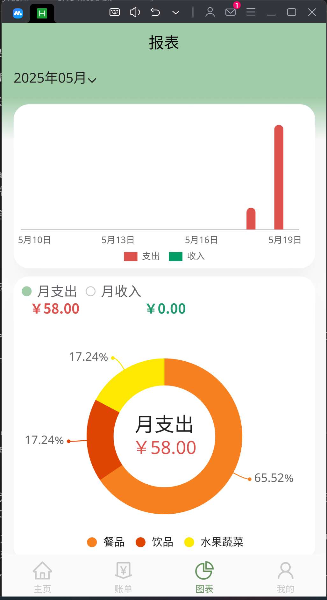
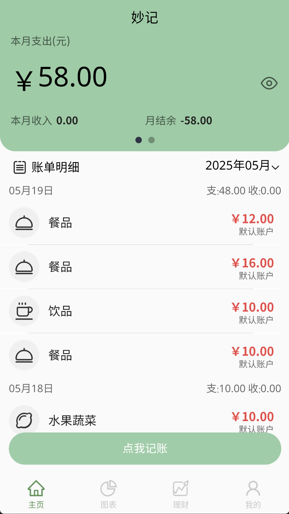
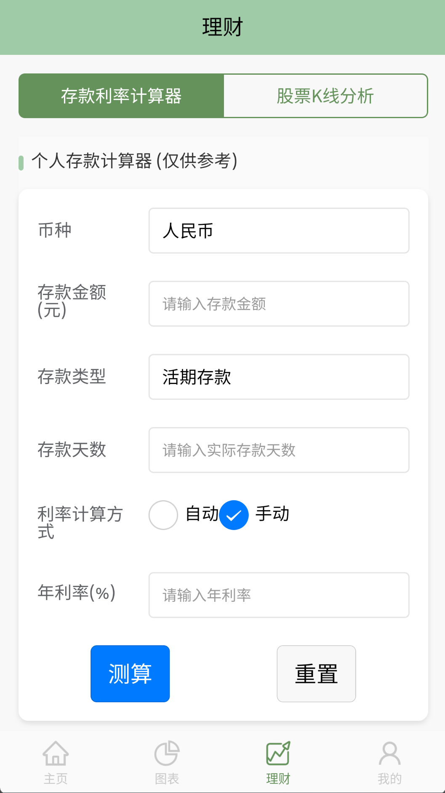
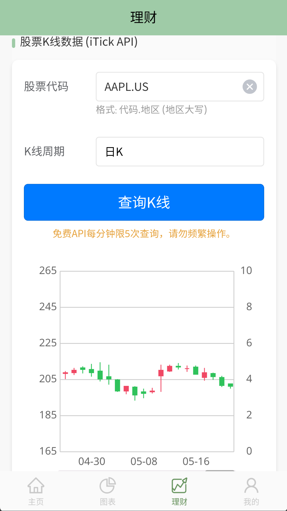
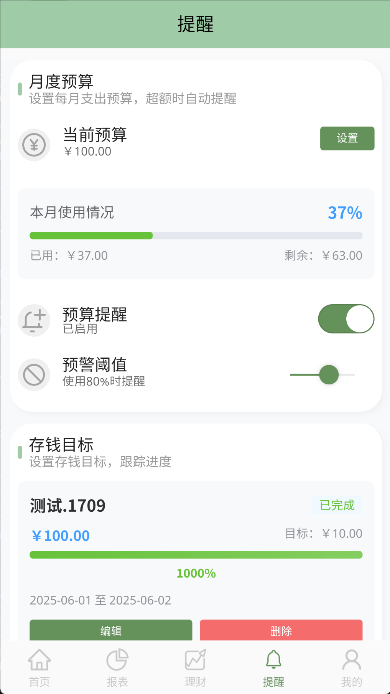
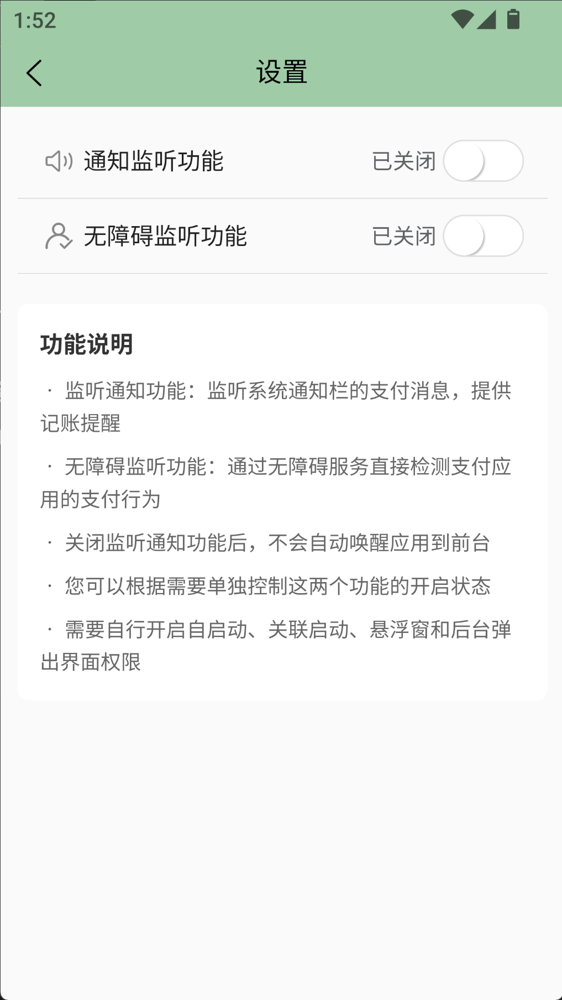
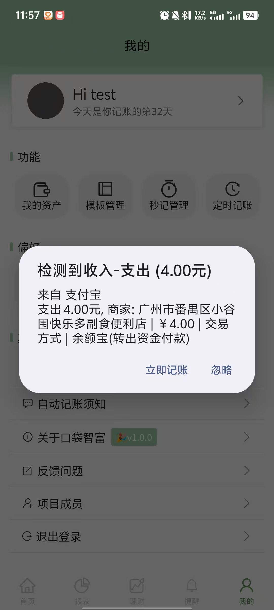

# 代码修改记录 苏逸翔

　　原始代码：

　　[ztkuaikuai/MiaoJi: 妙记✨记录你的生活。轻量记账小程序，在微信搜索妙记账单体验，使用uniapp与uniCloud进行开发。小程序毕设、毕业设计。](https://github.com/ztkuaikuai/MiaoJi)

### 部署参考：

#### 妙记是什么

　　妙记是基于 Vue2 的 Uniapp 和 Unicloud 制作的轻量记账应用。目前有微信小程序端和使用 uni-admin 搭建的后台管理 web 端。

　　*你可以通过 DeepWiki 生成的*​*[项目文档](https://deepwiki.com/ztkuaikuai/MiaoJi)*​*来详细了解该项目的结构和实现*。

#### 演示


#### 快速启动⭐

#### 前提条件

1. 妙记通过 HBuilderX 进行开发，在微信开发者工具中预览效果。所以需要你先下载 [HBuilderX](https://hx.dcloud.net.cn/README) 和[微信开发者工具](https://developers.weixin.qq.com/miniprogram/dev/devtools/devtools.html)。
2. 妙记使用 UniCloud 作为云开发平台（可以理解为服务端），需要你在 [UniCloud 控制台](https://unicloud.dcloud.net.cn/)注册登录并创建服务空间，免费的就行，以便后续开发使用。

#### 拷贝项目

　　fork 项目到你的仓库拷贝或者直接通过 `git clone`​ 命令拷贝[妙记](https://github.com/ztkuaikuai/MiaoJi)到本地，通过 HBuilderX 打开该项目。

#### 初始化项目

1. 右键 uniCloud 文件夹，关联你的云服务空间。
2. 创建 uni-id 配置文件。在 `/uni_modules/uni-config-center/uniCloud/cloudfunctions/common/uni-config-center`​ 下创建 `uni-id`​  
    文件夹，然后在 `uni-id`​ 文件夹中创建 `config.json`​ ，内容为下，注意将注释删掉：

```json
// 配置项参考：https://doc.dcloud.net.cn/uniCloud/uni-id/summary.html#config
{
	"passwordSecret": [{
		"type": "hmac-sha256",
		"version": 1
	}],
	"passwordStrength": "medium",
	"tokenSecret": "这里写你的密钥，可以是无意义的字符串",
	"mp-weixin": {
		"tokenExpiresIn": 259200,
		"tokenExpiresThreshold": 86400,
		"oauth": {
            // 微信小程序登录所用的appid、appsecret需要在对应的小程序管理控制台获取
			"weixin": {
				"appid": "填写你小程序的appid",
				"appsecret": "填写你小程序的appsecret，注意一定不要泄露！"
			}
		}
	},
	"userRegisterDefaultRole": ["USER"]
}
```

3. 上传所有的云函数和数据库表。右键 uniCloud 文件夹中的   `cloudfunctions`​ ，点击「上传所有云函数、公共模块及 Actions」；右键 `database`​ ，点击「上传所有 DB Schema (含扩展)」。

    > 如果中途有弹窗，云函数点击「替换」，云数据库勾选「全部创建」后点「是」。
    >
4. 在 `manifest.json`​ 中更新你的配置。微信小程序配置，将 appid 替换成你自己小程序的 appid ；基础配置，将「uni-app 应用标识」重新获取，利用查找替换将项目中带有 `__UNI__EE89725`​ 的替换成你自己的。
5. 点击 HBuilder 顶部「运行-运行到小程序模拟器-微信开发者工具」运行项目~
6. 配置小程序合法域名，请[参考文档](https://doc.dcloud.net.cn/uniCloud/publish.html#useinmp)

　　‍

#### 项目结构

```js
uniCloud/               // 使用阿里云的云空间
  |-cloudfunctions/     // 存放云函数、云对象
  |-database/           // 存放数据库表结构，参考文档：https://siu9p6v1zlb.feishu.cn/docx/WvmfdEmzsoBCIhxUpN6cAw8Nn7b?from=from_copylink
.hbuilderx
components/             // 存放妙记的组件
pages/                  // 存放主要模块，即tabbar的4个页面，其余页面分包处理
pagesAccount/           // 记账模块
pagesFilter/            // 未开发完，筛选模块
pagesMy/                // 我的模块
static/                 // 静态资源，存放icon、图片等
uni_modules/            // 存放在插件市场下载的包
unpackage/
utils/                  // 存放可复用的工具函数
.gitignore
App.vue
CHANGELOG.md
index.html
LICENSE
main.js
manifest.json           // 应用的配置文件
pages.json              // 项目页面配置，相当于微信小程序当中的 app.json
README.md
uni.promisify.adaptor.js
uni.scss                // 全局的样式文件
```

　　‍

　　‍

## 主要修改记录：

### 2025.5.14-15

#### 1. 补充登录模块

　　将原项目使用login-withoutpwd改为login-withpwd，完善了登录页面，现在可以在小程序和APP端正常登录。

　　目前APP端只支持注册账号和登录，还需要完善其他子模块。

　　‍

#### 2. 完善资产模块

　　现在移动端APP切换到资产页面时能直接加载出资产了，不会出现看不到资产的问题。

　　完成了同名资产自动合并（在首页 index.vue 中添加了 mergeAssets 方法并修改了 getUserAssets 方法，在设置资产页面 set-asset.vue 中修改了保存资产的逻辑）。

　　现在移动端APP能像小程序那样，正常修改/增加/删除资产，并立即显示更新后的页面（将资产列表的获取、合并和缓存管理集中在 pages/index/index.vue 中。mj-asset-card.vue 变为一个更纯粹的展示组件，依赖于父组件传递的prop。set-asset.vue 在修改数据后，只负责通知 index.vue 更新。）

　　‍

#### 3. 完善`.user-assets-list`​样式

　　现在在移动端APP，记账→选择账户时，能正常显示账户列表，不会超出画面（主要是修改.content高度，以及overflow属性控制）。

　　‍

### 2025.5.18

#### 1. 改善登录模块样式

　　使登录页面居中。

#### 2. 增加用户服务协议和隐私政策条款页面

　　放在pages/common目录，修改uni-id-pages/config.js，pages.json。

　　更新uni-id-pages-agreement.vue的navigateTo方法，因为它原来只会将url交给webview组件，试图访问外部链接；现在协议是内置的，所以要加入区分内外部地址的逻辑。

　　在协议/条款页面下方加上了返回登录页面的按钮。

#### 3. 尝试解决打开账单页面时后台的报错

　　在mj-bill-details-popup和mj-bill-card做了相应的安全处理，主要应对prop传来空bill的问题，目前能保持正常操作账单项（点击账单项操作），以及正常显示账单项和对应icon，但后台还有报错需要解决。

　　‍

### 2025.5.19~5.22

#### 1. 点开账单页面时要重新加载账单

　　在**onShow**生命周期加入`this.getUserBills()`​。

#### 2. 把账单页面的账单明细（按月展示整个月的账单）移到首页记账

- 移除原有的“近三日账单”显示。
- 将 pages/bills/bills.vue 中的日期选择器、月度账单明细列表、月支出和月收入总览功能迁移过来。

#### 3. 把账单页面的柱状图移到报表页面

　　pages/charts/charts.vue 文件已修改。（待完善：若为本月度情况，柱状图未能直接按当日显示）

​

#### 4. 改动登录页面下方的快捷登录实现

　　原来会出现重叠，因为同时使用了手动编写的“手机号登录”按钮和 <uni-id-pages-fab-login> 组件。（修改login-withpwd页面）

　　于是，移除 <uni-id-pages-fab-login> 组件。修改现有的“手机验证码登录按钮”区域，将其扩展为包含“短信验证码”、“微信登录”和“一键登录”三个选项，并调整图标和文字以尽量匹配图片样式。在 <script> 部分添加 loginByWeixin (微信登录) 和 loginByUniverify (一键登录) 的方法。

#### 5. 进一步改进主页记账展示

　　现在更符合逻辑，也不会有多余的月支出/月收入模块，还把选择月份的筛选器移到了“账单明细”同行，右对齐。

1. 将 <mj-datetype-picker> 组件从当前的 .header-fixed 容器中移动到 .bill-list 下的 .header 容器中。
2. 调整 .bill-list .header 的样式，使用 Flexbox 布局来实现“账单明细”及其图标居左，月份选择器居右的效果。

　　可能还需要微调“账单明细”和月份筛选器的高度对齐。（浏览器渲染似乎没问题？）

​

#### 6. 准备实现理财页面

　　试图利用选项卡，切换利率计算器/股票页面。

　　简单实现利率计算器；股票页面暂时通过webview借用新浪财经页面，但层级过高会覆盖整个页面。

　　‍

### 2025.5.23~5.24

#### 1. 实现理财页面

　　现在理财页面有一个利息计算器和一个股票K线页面。（使用uni-segment-control选项卡）

​

　　股票K线分析页面使用itick api和Ucharts（qiun-data-charts），参考：

　　[K线查询](https://itick-cn.readme.io/reference/get_stock-kline)

　　[文档 - uCharts跨平台图表库](https://www.ucharts.cn/v2/#/document/index)

　　拖动图表关键在于启用ontap等属性，绑定三个touch事件。

　　‍

#### 2. 完善主页记账展示

　　简单优化了文字内容以及排版。

　　‍

#### 3. 解决图表页面报错

　　加载图表时报缺失item项，修改mj-category-card的v-for循环内容解决。

　　‍

#### 4. “我的”页面更新

##### 4.1. 卡片及时更新内容

　　切换账号后，页面上方的卡片不能立即更新为新账户的信息。解决方法：退出时清除该用户缓存信息。

##### 4.2. 自定义头像功能

　　原先只支持微信小程序，现在为移动端加上了自定义头像功能。

- 针对微信小程序：利用其原生 chooseAvatar 能力，直接获取并使用微信提供的头像URL。
- 针对App及其他端：实现标准的“选择图片 -> 上传到云存储 -> 获取永久URL”流程。
- 统一处理：将获取到的新头像URL（无论是来自微信还是云存储）交由一个公共方法去更新UI、数据库和本地缓存。

　　‍

　　‍

### 2025.5.25~5.30

#### 1. 开始构建uni-admin

　　应该需要另外创造一个uni admin项目，经过尝试，目前只能修改用户权限（类似禁用账户）。

#### 2. 解决“再记”bug

　　在 addOneBill 和 addOneTransfer 方法的 "再记" 逻辑中，于 uni.reLaunch 之前显式调用uni.hideLoading()。

　　在 upDateUserAssetBalance 和 upDateUserTwoAssetBalance 方法中，修改了逻辑，使得仅在非 "再记" (即 !this.isAddAgain) 的情况下，才会 **await** this.asyncEmitUpdateAssets()。

　　现在不会卡在加载框了。

　　一并解决以下两个相关的问题。

1. “保存”新的账单后，会一直停在“记一笔”页面，不会跳转回主页。

    对于普通保存操作（包括 "再记" 之后的第二次保存），可以不强制 await 等待 asyncEmitUpdateAssets 完成。首页的资产数据更新可以作为一个非阻塞的后台操作。从 await this.asyncEmitUpdateAssets() 改为 this.asyncEmitUpdateAssets()。
2. “再记”的时候，页面左上角没有返回主页的按钮。

　　使用 uni.navigateTo 跳转到一个新的 make-an-account 页面实例，并附带 from=addAgain 和时间戳参数。因为是 navigateTo，所以新页面左上角会有返回按钮，可以返回到上一个（也是 make-an-account）页面。为了避免要连续点两次返回才能回到主页，在 make-an-account.vue 页面中处理返回事件来实现“再记后，点击返回直接回首页”。当页面是通过“再记”加载时，我们可以拦截物理返回键或导航栏返回按钮的默认行为，并将其重定向到首页。

#### 3. 解决修改账单造成的资产显示错误

　　mj-bill-card会跳转到记一笔make-an-account页面，但是并没有载入原账单的数据。make-an-account.vue 文件中的 onLoad钩子函数里，this.$refs.tabs.clickHandler({},tab) 这行代码引发了一个错误："TypeError: Cannot read property 'clickHandler' of undefined"。

　　可能是在执行这行代码时，Vue 还没有找到模板中 ref="tabs" 的那个组件或元素。onLoad 钩子函数在页面加载时执行，但此时子组件可能还没有完全渲染完毕。为了解决这个问题，我们可以使用 this.$nextTick()。

```vue
					this.$nextTick(() => {this.$refs.tabs.clickHandler({},tab)})
```

#### 4. 补充加载框、提示框、将一些方法改为异步并引入异常处理块

　　主要修改make-an-account页面。

　　在进行异步操作（如数据加载、保存）时提供用户反馈，提升体验；

　　将多个涉及数据库调用和异步操作的方法修改为async，调用时使用await，并引入try...catch...finally块。

#### 5. 对 mj-bill-template.vue 的改动（修复记账时无法使用模板）

　　修复该子组件无法正确显示从父组件传入的 templateList 数据的问题，主要是make-an-account调用子组件时无法显示出模板。

- 对 props: ['templateList'] 的 watch 侦听器，增加了 { immediate: true, deep: true } 配置。
- 在 mounted 钩子中增加了一个检查逻辑：如果 templateList 有数据但 formatTempList 仍为空，则再次调用 this.formatTemp()。
- formatTemp 方法健壮性增强。

　　通过移除<template>中`@click.native`​的 .native 修饰符，解决了模板点击事件不触发的问题（也一并解决了“我的”页面内模板管理不触发点击的问题）。

　　修改了template-list的高度。

#### 6. 解决编译时发生的警告

　　(378:3) start value has mixed support, consider using flex-start instead Module Warning (from ./node_modules/postcss-loader/src/index.js)。

　　搜索项目里包含的justify-content: start; 全部改为justify-content: flex-start; 都是在mj开头的文件发现的。

#### 7. 解决资产管理页面显示资产错误的问题

　　通过 mj-asset-card 组件展示的资产列表，其资产名称和图标显示不正确。

　　修改watch内的handler部分内容：

```vue
				handler: function(newAssetsFromDB) {
					if (newAssetsFromDB && Array.isArray(newAssetsFromDB)) {
						this.assets = newAssetsFromDB.map(asset => {
							// 优先使用 asset 对象上已有的 assetStyle
							const styleToUse = asset.assetStyle || this.assetsStyle.find(style => style.type === asset.asset_type) || this.defaultAssetStyle;
							return {
								...asset, // 展开原始资产属性
								assetStyle: styleToUse // 使用已有的或新查找到的 assetStyle
							};
						});
					}
```

　　原先会直接调用find方法，但实际上asset已经有assetStyle了不需要重新寻找。确保 mj-asset-card 组件优先使用父组件已经处理好的、正确的 assetStyle，从而解决资产名称和图标显示不正确的问题。

　　‍

　　‍

### 2025.5.31~6.1

#### 1. 优化账单加载体验

　　现在加载账单和资产时有加载框了；加载资产时，原有的默认占位被移除了。

#### 2. 新增 “提醒”页面



　　核心是`pages/reminder/reminder.vue`​页面，它作为主Tab之一，集成了月度预算管理和存钱目标追踪两大关键功能。

　　新建了两个表`pockfi-user-budgets`​和`pockfi-user-saving-goals`​。

##### 2.1 `pages/reminder/reminder.vue`​实现

###### 2.1.1 月度预算管理

- **预算设置**: 用户可以设定月度总支出预算金额及预警百分比（如80%）。
- **使用追踪**:

  - 实时显示当月已支出金额和预算剩余金额。
  - 以百分比和彩色进度条（根据超支程度变色：绿-黄-红）直观展示预算使用情况。
  - 月度支出计算已优化，能正确包含普通支出、转账手续费以及转账金额本身。
- **提醒开关**: 用户可以启用或禁用预算超额提醒功能。
- **数据库交互**:

  - 预算数据存储在 `pockfi-user-budgets`​ 表。
  - 涉及字段：`user_id`​, `budget_month`​, `budget_amount`​, `is_enabled`​, `warning_threshold`​。

###### 2.1.2 存钱目标管理

- **目标创建与编辑**:

  - 用户可以设定目标名称、目标金额、开始日期和可选的结束日期。
  - 支持对已创建的目标进行编辑。
- **进度追踪**:

  - 以金额和百分比展示当前已存入金额与目标金额的差距。
  - 使用进度条可视化存钱进度。
- **智能状态管理**:

  - **数据校准**: 页面加载时（`onLoad`​, `onShow`​），会**重新计算**每个启用的存钱目标在设定周期内的实际总收入，而不是依赖之前累加的 `current_amount`​。
  - **数据库同步**: 根据重新计算的结果，更新数据库中每个目标的 `current_amount`​, `is_completed`​ (是否完成), `completion_date`​ (完成日期), 和 `completion_shown_to_user`​ (是否已向用户展示完成提示)字段。这确保了即使在账单被修改或删除后，目标状态依然准确。
  - **实时响应**: 监听由记账、编辑、删除账单操作触发的 `savingGoalsMightUpdate`​ 事件，收到事件后会重新执行上述数据获取和校准流程。
- **完成提醒**: 当目标达成时，会弹窗向用户表示祝贺。如果目标因账单变动从完成变为未完成，相关提示状态也会重置。
- **数据库交互**:

  - 存钱目标数据存储在 `pockfi-user-saving-goals`​ 表。
  - 涉及字段：`user_id`​, `goal_name`​, `target_amount`​, `current_amount`​, `start_date`​, `end_date`​, `is_completed`​, `is_enabled`​, `completion_date`​, `completion_shown_to_user`​。

##### 2.2 其他相关修改

###### 2.2.1 记账页面 (`pagesAccount/make-an-account/make-an-account.vue`​)

- **事件通知**:

  - 在用户成功**新增**一笔账单（支出、收入或转账）后，会发送 `uni.$emit('savingGoalsMightUpdate')`​ 事件。
  - 在用户成功**编辑**一笔账单后，同样会发送 `uni.$emit('savingGoalsMightUpdate')`​ 事件。
- **存钱目标处理**:

  - 当记录一笔**收入**时，会调用 `processSavingGoalsAfterIncome`​ 方法。此方法会检查是否有存钱目标因此次收入而达成，并更新数据库中对应目标的状态（包括标记为已完成并向用户弹窗提示）。

###### 2.2.2 账单卡片组件 (`components/mj-bill-card/mj-bill-card.vue`​)

- **事件通知**:

  - 当用户成功**删除**一笔账单后，会发送 `uni.$emit('savingGoalsMightUpdate')`​ 事件。

###### 2.2.3. 路由配置 (`pages.json`​)

- 将 `pages/reminder/reminder.vue`​ 添加为主包页面，并配置为底部 TabBar 的一项。

　　‍

　　关键点主要在于

1. 自动数据校准：无论何时进入提醒页面，或相关账单发生变动，系统都会重新计算目标的实际进度，确保数据的最终准确性，并同步更新数据库；
2. 跨页面数据同步与响应；
3. onShow钩子重新加载数据进一步增强健壮性。

　　‍

#### 3. 秒记优化

　　发现问题：秒记绑定模板时，按钮样式不对；绑定模板1后，在记一笔界面会消失“秒记1”文字；没有解绑按钮。

　　修改如下：

1. 在make-an-account内，把秒记按钮文本（name）改为响应式更新：

    - 引入了两个计算属性：keyboardSecondOneName 和 keyboardSecondTwoName。
    - 这两个计算属性分别根据 this.secondOneData.second_name 和 this.secondTwoData.second_name 的值返回秒记名称，如果秒记数据或名称为空，则返回默认的 "秒记1" 或 "秒记2"。可以使用**可选链操作符 (Optional Chaining Operator ?.) 来更简洁地实现类似的效果**：

      所以，在这种类似三元运算符的操作中，要么使用`(this.secondOneData && this.secondOneData.second_name)?this.secondOneData.second_name:"秒记1")`​，要么使用`this.secondOneData?.second_name || '秒记1'`​。
    - <u-keyboard> 组件的 :secondOne 和 :secondTwo prop 现在绑定到这两个计算属性。
    - 这确保了即使在秒记别名发生改变（例如，在 seconds.vue 页面修改并保存后），记一笔页面的键盘上显示的秒记按钮文本也能正确地、响应式地更新。

2. 在seconds内：

    - 在编辑秒记的弹窗中增加了“解绑模板”按钮。
    - “解绑模板”按钮显隐逻辑优化（搭配v-if）：引入了计算属性 isTemplateActuallyBound，判断当前编辑的秒记是否已在数据库中绑定了一个 有效 的模板；
    - 秒记弹窗内按钮样式调整：

      - “解绑模板”按钮设置为红色描边、白色背景、红色文字 (type="error" plain="true")。
      - “保存”按钮设置为主色调描边、白色背景、主色调文字 (type="primary" plain="true")。
      - 调整了两个按钮的自定义样式 (customStyle)，以适应并排布局。
    - 默认秒记名称处理。
    - 完成解绑按钮的修复，unbindTemplate 方法内，更新到数据库的 template_id 和本地的 this[this.secondType].tempId 都设置为 this[this.secondType]._id（秒记条目自身的ID）才可以正常删除模板。

　　‍

#### 4. 文本改动

　　把“妙记”相关文本改为“口袋智富”，更改版本信息和作者信息。

　　‍

#### 5. 登录相关完善

1. 为“退出登录”增加弹窗确认
2. 从插件市场更新uni-easyinput插件

　　‍

### 2025.6.9~6.14

### 1. 原生插件引入

　　需要开启通知监听权限、无障碍功能；并自行开启自启动、关联启动、悬浮窗和后台弹出界面权限。

#### 1.1 完成通知栏检测功能

　　引入nativeplugins  **Notification**，修改settings.vue和App.vue，现在可以监听特定应用发出的与金额相关的通知，并自动跳转到前台，弹窗确认。

　　‍

#### 1.2 完成微信支付页面、支付宝支付页面、支付宝账单的无障碍检测

　　引入nativeplugins  **MonitorPayinform**，继续修改settings.vue和App.vue，现在可以无障碍检测微信支付页面、支付宝支付页面、支付宝账单，并自动跳转到前台，弹窗确认。

​

　　‍

### 2. 其他优化

#### 2.1 资产金额报错调整

　　修改set-asset.vue，在资产页面设置负数资产时，从“最多填写两位小数”的报错改为“资产余额不能设为负数”。

　　‍

#### 2.2 资产金额精度调整

　　将项目中存在的将元转为分的逻辑从运用如`Math.round(userAsset.asset_balance * 100)`​，改为更安全的金额转换函数，都写在utils/amount-utils.js内。这样就避免了直接填入金额为小数时发生的精度报错，如`2856599999999999500 超出了精度限制，结果可能不正确 at uni_modules/uview-ui/libs/function/digit.js:45`​

```javascript
export function convertYuanToCent(amount) {
	// 将数字转换为字符串，避免浮点数精度问题
	const amountStr = parseFloat(amount).toFixed(2)
	// 找到小数点位置
	const dotIndex = amountStr.indexOf('.')
	if (dotIndex === -1) {
		// 没有小数点，直接乘以100
		return parseInt(amountStr) * 100
	} else {
		// 有小数点，移除小数点后转换为整数
		const integerPart = amountStr.substring(0, dotIndex)
		const decimalPart = amountStr.substring(dotIndex + 1)
		// 确保小数部分有两位
		const paddedDecimal = decimalPart.padEnd(2, '0').substring(0, 2)
		return parseInt(integerPart + paddedDecimal)
	}
}
```

#### 2.3 删除make-an-account页面的加载框

　　原先在onLoad周期里写上了“加载中...”加载框，实际上不需要而且可能缺少及时的hideLoading逻辑，导致快速改变页面时可能一直有加载框显示而无法结束。

　　‍

#### 2.4 剔除转账与预算的绑定

　　内部转账应该与预算提醒无关，在reminder.vue, make-an-account.vue和charts.vue内删除了相关的逻辑，使预算只与内部转账有关。

　　‍

#### 2.5 修改了股票页面与api有关的逻辑

　　由于免费api会过期，现在增加一个输入框，接收用户输入的api。默认会预输入一个免费api，如果用户不小心删除了（本格为空）也会从这个默认api尝试获取数据。

　　‍

#### 2.5 修改“关于”页面和“设置”页面

　　在“关于”页面增加新版本的说明；在“设置”页面允许用户开关原生功能（通知栏和无障碍）。

　　‍

#### 2.6 修改token过期时限

　　位于Pockfi\uni_modules\uni-config-center\uniCloud\cloudfunctions\common\uni-config-center\uni-id\config.json，

　　当前的 tokenExpiresIn (token有效期) 设置为 259200 秒，也就是 259200 / 3600 / 24 = 3 天。

　　另一个 tokenExpiresThreshold (token刷新阈值) 是 86400 秒，也就是1天。它的作用是当token使用超过1天后，会自动刷新，避免过期。

- Token 有效期 (tokenExpiresIn) 已经从 259200 秒 (3天) 修改为 604800 秒 (7天)。
- Token 刷新阈值 (tokenExpiresThreshold) 也已从 86400 秒 (1天) 修改为 259200 秒 (3天)。

　　‍
